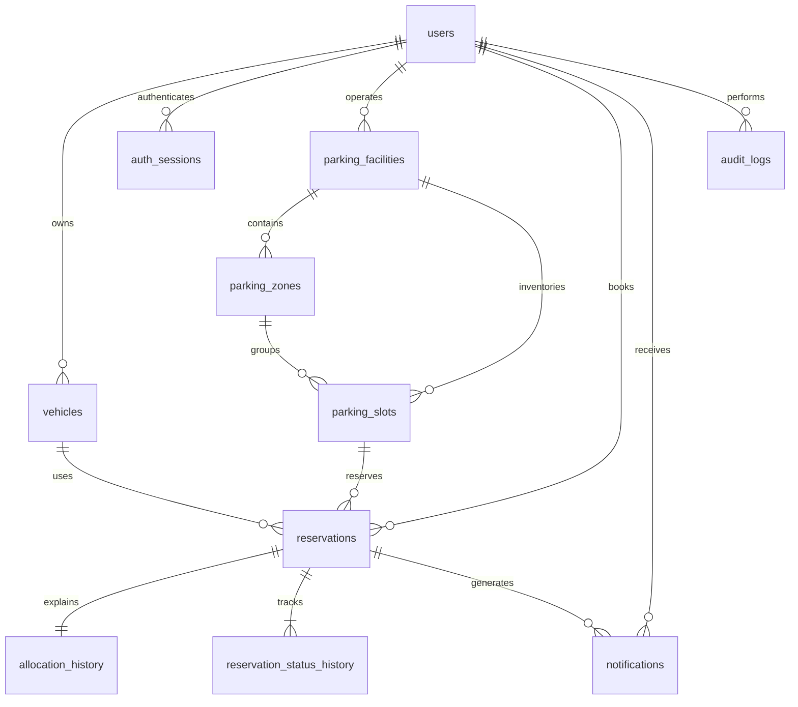

# Entity relationships

```mermaid
erDiagram
  users ||--o{ vehicles : owns
  users ||--o{ auth_sessions : authenticates
  users ||--o{ parking_facilities : operates
  users ||--o{ reservations : books
  users ||--o{ notifications : receives
  users ||--o{ audit_logs : performs
  parking_facilities ||--o{ parking_zones : contains
  parking_facilities ||--o{ parking_slots : inventories
  parking_zones ||--o{ parking_slots : groups
  parking_slots ||--o{ reservations : reserves
  vehicles ||--o{ reservations : uses
  reservations ||--|| allocation_history : explains
  reservations ||--|{ reservation_status_history : tracks
  reservations ||--o{ notifications : generates
```
